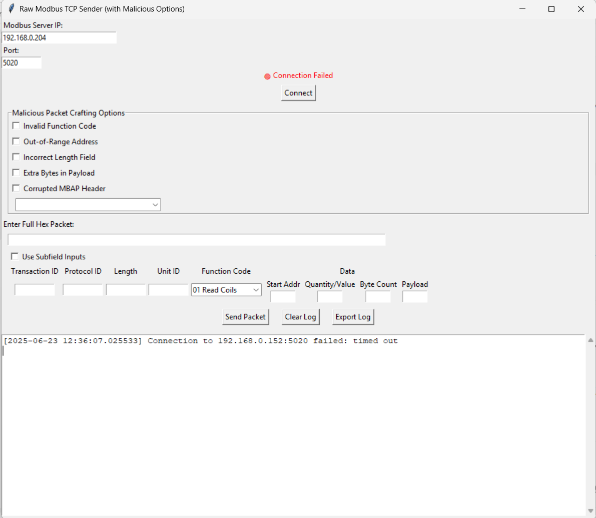
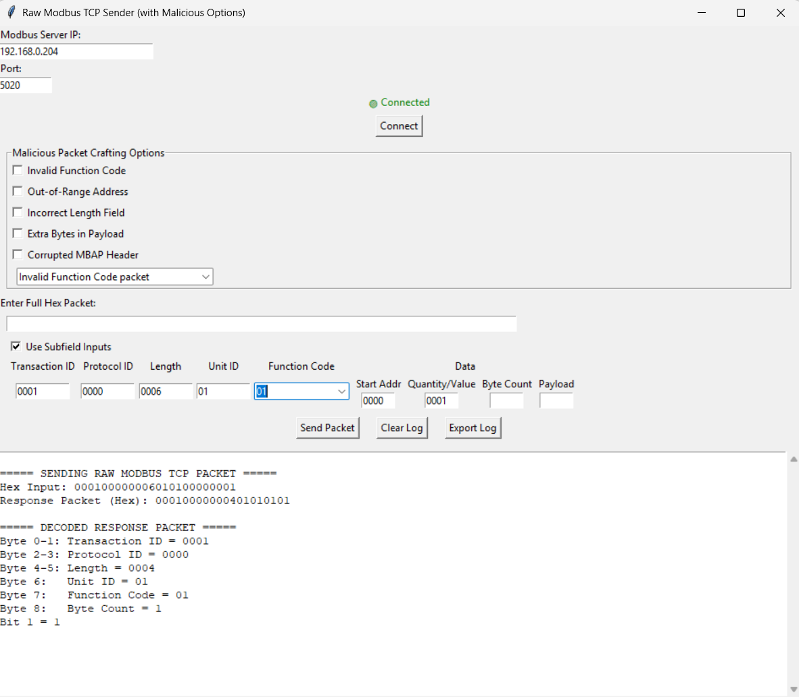
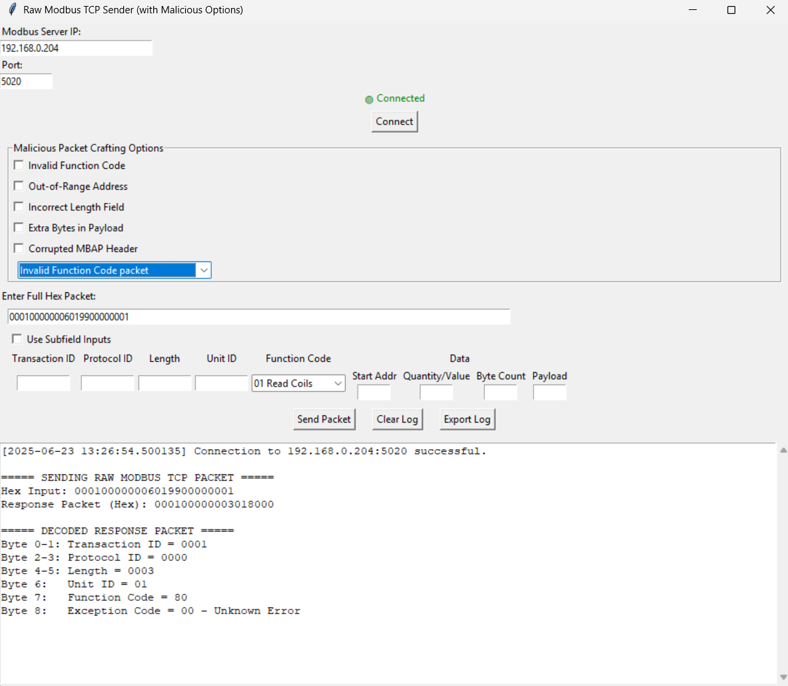

# Modbus Client (Educational Modbus TCP Packet Crafter)

This project provides a GUI-based Modbus TCP client tool written in Python. It is designed **for educational and research use** to understand Modbus protocol. The tool allows users to craft, send, and analyze both standard and malicious Modbus TCP packets to better understand protocol behavior and security.

---

## Features

- **Connect to a Modbus TCP server** by specifying IP and port.
- **Manually craft raw Modbus TCP packets** (hex editor).
- **Structured field mode**: Fill out fields like Transaction ID, Protocol ID, Function Code, etc.
- **Predefined malicious packets**: Instantly load commonly used attack/malformation payloads.
- **Malicious crafting options**: Toggle invalid function code, out-of-range address, incorrect length, extra payload bytes, or corrupt headers.
- **Live response decoding**: View raw response in hex and parsed form.
- **Log all transactions** with option to export log.
- **Cross-platform** (Windows, Linux, macOS, Python 3.7+).

---

## Screenshots

## Screenshots1
*Main application window.*  


## Screenshots2
*Structured packet fields view.*  


## Screenshots3
*Malicious crafting options.*  


---

## Installation

### Requirements

- **Python** `3.7+`  
- **tkinter**  
  - *Windows/macOS:* Usually included.  
  - *Linux:* Install with:  
    ```sh
    sudo apt-get install python3-tk
    ```
- **Internet access** (to install dependencies with `pip`)

### Clone the Repository

```sh
git clone https://github.com/YourUser/modbus-packet-crafter.git
cd modbus-packet-crafter
```

### Dependencies

This project uses the following Python modules:

- `tkinter` and widgets (`scrolledtext`, `filedialog`, `ttk`, `messagebox`)
- Standard libraries: `socket`, `datetime`, `struct`
- [`scapy`](https://scapy.readthedocs.io/) — for advanced packet crafting (optional)
- [`pymodbus`](https://pymodbus.readthedocs.io/) — for Modbus protocol support and simulation (optional)
- [`typing-extensions`](https://pypi.org/project/typing-extensions/) — for type hinting and compatibility

> **Note:**  
> The `socket`, `datetime`, and `struct` modules are standard with Python.  
> `tkinter` is included on most platforms but may need manual installation on Linux.

### Quick Install

```sh
pip install -r requirements.txt
```

### Manual Install

```sh
pip install tk scapy pymodbus typing-extensions
```

On Linux, if you get errors related to `tkinter`, run:

```sh
sudo apt-get install python3-tk
```

---

## Port Permissions

Modbus TCP typically uses port `502`, which may require administrator/root privileges on Unix/Linux.

For testing, you can use a higher port (e.g., `1502`) for both the client and server to avoid requiring admin access.

---

## Usage

1. Start a test Modbus server (e.g., using `pymodbus`, ModbusPal, or other simulator).
2. Run the client:
    ```sh
    python src/modbus_client.py
    ```
3. Enter the server IP and port, click **Connect**.
4. Craft your packet using **raw hex** or **structured fields**.
5. *(Optional)*: Apply malicious crafting options or load a predefined packet.
6. Click **Send Packet**.
7. View the **response** (hex and decoded) and **analyze logs**.
8. Use **Export Log** if needed.

---

## Example Packets and Their Effects

### 1. Write Single Coil (ON)

```
Packet: 0001 0000 0006 01 05 0001 FF00
```

- **Breakdown:** Transaction=0x0001, Protocol=0x0000, Length=6, Unit=0x01, Function=0x05 (Write Coil), Address=0x0001, Value=0xFF00 (ON)  
- **Effect:** Turns coil #1 **ON** (e.g., starts a motor or opens a valve)

---

### 2. Write Single Coil (OFF)

```
Packet: 0002 0000 0006 01 05 0001 0000
```

- Turns coil #1 **OFF** (deactivates the device)

---

### 3. Write Holding Register

```
Packet: 0003 0000 0006 01 06 0002 000A
```

- **Function 0x06**, Register Address `0x0002`, Value `10`.  
- Changes a control setpoint, e.g., voltage or speed

---

### 4. Invalid Function Code

```
Packet: 0004 0000 0006 01 90 0001 0001
```

- Function code `0x90` is invalid. The slave will respond with:
  - Function: `0x90 + 0x80 = 0x110`
  - Exception Code: `0x01` (Illegal Function)

---

### 5. Length Mismatch / Corrupted Header

```
Packet: 0005 0000 0007 01 05 0001 FF00 AA
```

- Declared length = 7, but actual data does not match.  
- **Effect:** Packet is ignored, simulating dropped request or desync

---

## Creating an Executable

You can convert this Modbus Client into a standalone executable so users can run it without needing Python or pip installed.

### 🔧 For Windows

1. **Install PyInstaller** (if not already installed):

    ```sh
    pip install pyinstaller
    ```

2. **Navigate to the `src/` directory**:

    ```sh
    cd src
    ```

3. **Build the .exe file**:

    ```sh
    pyinstaller --onefile --windowed modbus_client.py
    ```

4. Output will be in the `dist/` folder:

    ```
    dist/modbus_client.exe
    ```

### 🐧 For Linux

1. **Install PyInstaller**:

    ```sh
    pip install pyinstaller
    ```

2. **Navigate to `src/`**:

    ```sh
    cd src
    ```

3. **Build the executable**:

    ```sh
    pyinstaller --onefile modbus_client.py
    ```

4. Output will be in:

    ```
    dist/modbus_client
    ```

5. Make it executable:

    ```sh
    chmod +x dist/modbus_client
    ```

### 📦 What to Share

- Only share the `modbus_client.exe` (Windows) or `modbus_client` (Linux)
- Python is **not required** to run the executable

> ⚠️ Build the executable on the **same OS** where it will run. Cross-compilation is not supported.

---

## 🔽 Download Executable

- 🪟 [Download for Windows (.exe)](https://github.com/Rajeshawal/modbus-client/releases/download/v1.0.0/MobusTCP_Client.exe)
- 🐧 [Download for Linux](https://github.com/Rajeshawal/modbus-client/releases/download/v1.0.0/ModbusTCP-Client)

> ✅ No Python installation required. Just download, run, and connect to your Modbus server.

---

## Responsible Use and Disclaimer

> ⚠️ **This tool is for educational and research purposes only.**  
> Use only on systems you **own or are authorized to test**.  
> Unauthorized use can cause **physical damage**, **safety hazards**, or **legal consequences**.  
> Always test in isolated environments.  
> By using this software, you agree to act **ethically and responsibly**.

---

## License

This project is licensed under the [MIT License](LICENSE).

---

## Contributing

Pull requests and bug reports are welcome.  
Feel free to open an issue or submit a PR!

---

## Folder Structure

```
modbus-client/
├── src/                # Python scripts (main GUI)
├── images/             # GUI screenshots
├── requirements.txt    # Python dependencies
├── README.md           # Project documentation
└── LICENSE             # MIT License
```

---

## Acknowledgements

- [Modbus.org](https://modbus.org/) — official protocol documentation  
- Educational security testing communities and open-source contributors
